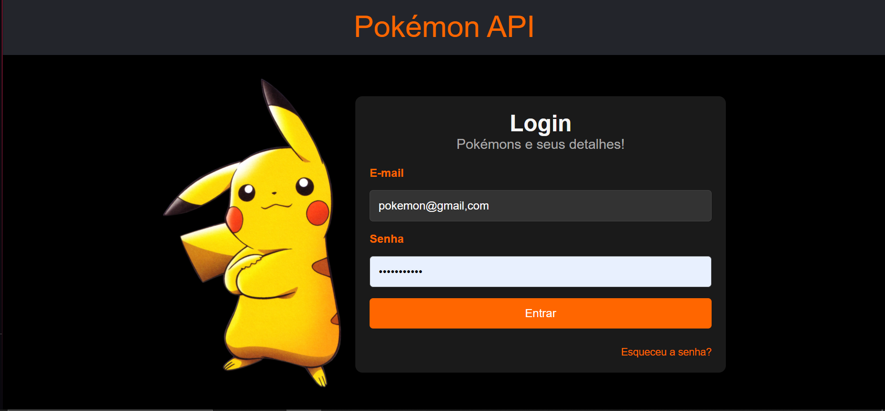
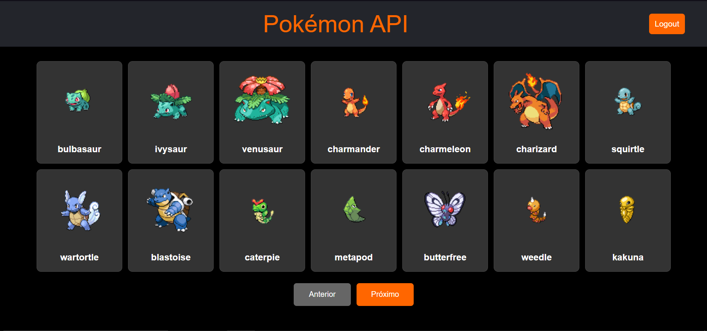
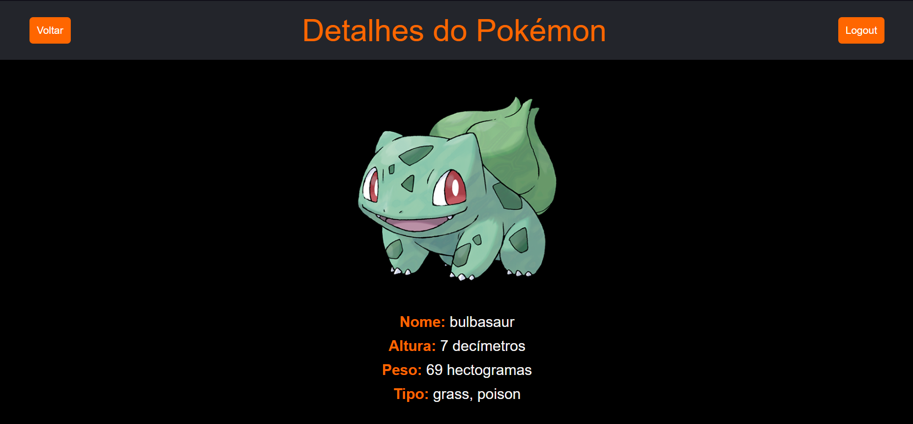

# Pokémon API Frontend

Este projeto é uma interface de usuário para visualizar informações sobre Pokémons utilizando a API de Pokémon.

## Funcionalidades

- Login de usuário
- Listagem de Pokémons
- Detalhes dos Pokémons

## Tecnologias Utilizadas

- React
- React Router
- Axios
- PokeAPI

## Telas

### Tela de Login

### Tela de Listagem de Pokémons

### Tela de Detalhes do Pokémon

